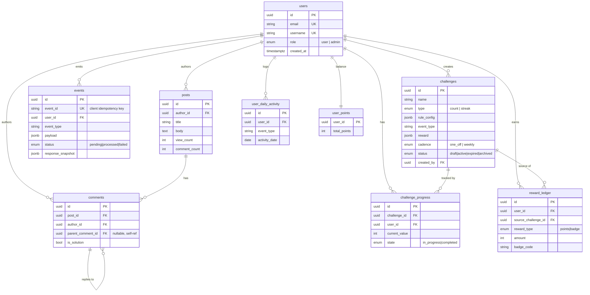

# Challenge & Rewards Engine + Developer Community Forum

A **Challenge & Rewards Engine** (FastAPI + PostgreSQL) integrated with a
**Developer Community Forum** (Next.js). The engine is fully decoupled from the
forum: it knows only about **events → challenges → progress → rewards**. The
forum emits events; the engine evaluates them asynchronously and grants rewards.

**🌐 Live demo — deployed entirely on Vultr Cloud Instance:** https://vultr-task.vevaar.com

---

## Overview

- Users browse and create threads, comment, and mark solutions.
- Every forum action emits an **event**.
- Admins create **data-driven challenges** (no hardcoded logic per challenge).
- A **background worker** evaluates events asynchronously and updates progress.
- Completing a challenge **disburses a reward** (points or a badge), idempotently.
- The frontend surfaces progress, streaks, rewards, and a leaderboard.


### Implemented features

**Backend**

- JWT auth via an **httpOnly cookie** (header auth also supported for tooling), with `user` / `admin` roles and a consistent error envelope.
- Forum: posts, **nested comments**, owner-only solution marking; each action emits an event.
- **Idempotent event ingestion** (`202 Accepted`, deduped by client `event_id`).
- **Data-driven challenges** (count + streak types) with full admin CRUD and lifecycle (`draft → active → expired → archived`).
- **DB-polling background worker** + a generic evaluator engine.
- **Idempotent reward disbursal** — points balance + immutable ledger, at most once per (user, challenge). Two reward types: **points** and **badges**.
- User read APIs: active challenges + progress, weekly challenge, progress, streaks, rewards ledger, leaderboard.
- **Tests** (pytest): streak logic, event idempotency, reward disbursal.

**Frontend**

- 5 pages: **Feed** (latest/trending, URL-synced pagination), **Post Detail** (nested comments, mark solution), **Create Post**, **Challenges & Progress**, **Profile / Rewards**.
- **Optimistic UI** on post + comment creation (instant, rolls back + toasts on failure).
- **Polling** on challenge/progress surfaces (evaluation is async).
- **Data visualization** with **Recharts** (radial progress rings) + a contribution streak heatmap.
- **Skeleton** loaders (no spinners), graceful **error fallbacks**, **URL state**, custom hooks.
- **Weekly Challenge widget** — persistent in the layout on every page, live via polling.
- **Leaderboard** page (bonus) + right-rail top-3 preview.
- **Auth-on-action**: guests browse publicly; an animated **login modal** appears only when they act.

---


## Architecture

```
                 emits events (202)              reads results (polling)
 ┌──────────────┐  POST /api/events   ┌──────────────────┐
 │  Next.js     │ ──────────────────► │  FastAPI (API)   │
 │  frontend    │ ◄────────────────── │  auth · forum ·  │
 │  :3000       │                     │  events · admin  │
 └──────────────┘                     └───────┬──────────┘
                                              │ writes event rows (status=pending)
                                              ▼
                                      ┌──────────────────┐
                                      │   PostgreSQL     │
                                      └───────┬──────────┘
                                              │ SELECT ... FOR UPDATE SKIP LOCKED
                                              ▼
                                      ┌──────────────────┐
                                      │  Worker process  │  generic engine:
                                      │  (polls events)  │  count + streak evaluators
                                      └──────────────────┘
```

**Tech stack:** Python · FastAPI · SQLAlchemy 2 · Alembic · PostgreSQL 16 ·
Docker Compose · TypeScript · Next.js (App Router) · Tailwind v4 · shadcn/Base UI ·
TanStack Query · Recharts.

---


## Prerequisites

- **Docker** + **Docker Compose** (for the backend + database + worker)
- **Node.js 20+** and **npm** (for the frontend)

---


## Setup

The repo has two services: `server/` (backend) and `client/` (frontend).

### 1. Backend (API + worker + Postgres)

```bash
# from the repo root
cp server/.env.example server/.env      # create backend env

docker compose up -d --build            # starts: db, api, worker
docker compose exec api alembic upgrade head   # create the database schema
```

- API: [http://localhost:8000](http://localhost:8000)
- Interactive API docs (Swagger): [http://localhost:8000/docs](http://localhost:8000/docs)
- Health check: [http://localhost:8000/api/health](http://localhost:8000/api/health)

Run the tests:

```bash
docker compose exec api pytest
```


### 2. Frontend

```bash
cd client
cp .env.example .env.local              # points at http://localhost:8000/api
npm install
npm run dev
```

- App: [http://localhost:3000](http://localhost:3000)

---


## Environment variables


### Backend — `server/.env.example`


| Variable                      | Purpose                                                                          |
| ----------------------------- | -------------------------------------------------------------------------------- |
| `DATABASE_URL`                | Postgres connection string (`postgresql://vultr:vultr@db:5432/challenge_engine`) |
| `JWT_SECRET`                  | Secret used to sign JWTs (use a long random string in prod)                      |
| `JWT_ALGORITHM`               | JWT algorithm (default `HS256`)                                                  |
| `ACCESS_TOKEN_EXPIRE_MINUTES` | Token lifetime (default `1440` = 24h)                                            |
| `ADMIN_SIGNUP_CODE`           | Register with this code to become an admin                                       |
| `COOKIE_SECURE`               | `false` locally (http), `true` in production (https)                             |
| `APP_TZ`                      | Timezone for "day" boundaries (streaks, weekly reset). Default `UTC`             |
| `WORKER_POLL_SECONDS`         | How often the worker polls the events table (default `2`)                        |
| `CORS_ORIGINS`                | Comma-separated browser origins allowed to call the API                          |


### Frontend — `client/.env.example`


| Variable                   | Purpose                                                   |
| -------------------------- | --------------------------------------------------------- |
| `NEXT_PUBLIC_API_BASE_URL` | Base URL of the API (`http://localhost:8000/api` locally) |


---


## Provisioning challenges (admin API)

The frontend is a **consumer** app; admins provision challenges through the
**admin API** (`/api/admin/challenges`), via Swagger or curl.

**1. Create an admin account** (register with the admin code):

```bash
curl -s -X POST http://localhost:8000/api/auth/register \
  -H 'Content-Type: application/json' \
  -d '{"email":"admin@example.com","username":"admin","password":"password123","admin_code":"make-me-admin"}'
```

The response contains an `access_token`. Export it (or paste it into Swagger's
**Authorize** dialog):

```bash
TOKEN="<paste access_token here>"
```

**2. Create a count-based challenge** (post 5 comments → 100 points):

```bash
curl -s -X POST http://localhost:8000/api/admin/challenges \
  -H "Authorization: Bearer $TOKEN" -H 'Content-Type: application/json' \
  -d '{
    "name": "Chatterbox",
    "description": "Post 5 comments this month",
    "type": "count",
    "rule_config": {"target": 5},
    "event_type": "comment_posted",
    "start_at": "2026-07-01T00:00:00Z",
    "end_at": "2026-07-31T23:59:59Z",
    "reward": {"type": "points", "amount": 100},
    "status": "active"
  }'
```

**3. Create a streak-based challenge** (comment 3 days in a row → a badge):

```bash
curl -s -X POST http://localhost:8000/api/admin/challenges \
  -H "Authorization: Bearer $TOKEN" -H 'Content-Type: application/json' \
  -d '{
    "name": "On Fire",
    "description": "Comment 3 days in a row",
    "type": "streak",
    "rule_config": {"days": 3},
    "event_type": "comment_posted",
    "start_at": "2026-07-01T00:00:00Z",
    "end_at": "2026-07-31T23:59:59Z",
    "reward": {"type": "badge", "code": "on_fire", "label": "On Fire"},
    "status": "active"
  }'
```

Other admin endpoints: `GET /api/admin/challenges` (list, `?status=` filter),
`PATCH /api/admin/challenges/:id` (update), `DELETE /api/admin/challenges/:id`
(archives — soft delete).

---


## Verifying the full flow

**event emitted → background job evaluates → progress updates → reward disbursed**

```bash
# 0. Have an active challenge (see above): Chatterbox — 5 comments → 100 points.

# 1. Register/login a normal user and capture their token
USER=$(curl -s -X POST http://localhost:8000/api/auth/register \
  -H 'Content-Type: application/json' \
  -d '{"email":"sam@example.com","username":"sam","password":"password123"}' \
  | python3 -c "import sys,json;print(json.load(sys.stdin)['access_token'])")

# 2. Create a post, then comment on it 5 times (each emits comment_posted)
PID=$(curl -s -X POST http://localhost:8000/api/posts -H "Authorization: Bearer $USER" \
  -H 'Content-Type: application/json' -d '{"title":"Hello","body":"first post"}' \
  | python3 -c "import sys,json;print(json.load(sys.stdin)['id'])")

for i in 1 2 3 4 5; do
  curl -s -X POST http://localhost:8000/api/posts/$PID/comments \
    -H "Authorization: Bearer $USER" -H 'Content-Type: application/json' \
    -d "{\"body\":\"comment $i\"}" >/dev/null
done

# 3. Watch the worker evaluate (polls every ~2s)
docker compose logs -f worker      # look for "processed N event(s)"

# 4. Verify progress, reward, and points
curl -s http://localhost:8000/api/users/me/progress -H "Authorization: Bearer $USER"
curl -s http://localhost:8000/api/users/me/rewards  -H "Authorization: Bearer $USER"
curl -s http://localhost:8000/api/leaderboard        -H "Authorization: Bearer $USER"
```

Within a couple of seconds, Chatterbox shows `5/5 completed`, the reward ledger
shows `+100 points`, and the leaderboard reflects the new balance. The **UI**
shows the same on the Challenges and Profile pages (which poll every 30s).

You can also emit a raw event directly (bypassing the forum):

```bash
curl -s -X POST http://localhost:8000/api/events -H "Authorization: Bearer $USER" \
  -H 'Content-Type: application/json' \
  -d '{"event_id":"evt-123","event_type":"comment_posted","payload":{}}'
# Re-sending the same event_id returns the original 202 without reprocessing.
```

---


## Design decisions


### DB schema rationale

The 9 tables and their relationships (all primary keys are UUIDs):



**Idempotency-critical unique constraints:**
- `events.event_id` — event-replay dedup
- `reward_ledger (user_id, source_challenge_id)` — a challenge rewards a user at most once
- `challenge_progress (challenge_id, user_id)` — one progress row per user per challenge
- `user_daily_activity (user_id, event_type, activity_date)` — activity is a per-day set

Per-table rationale (see `server/app/models`):

- `users` — identity + role.
- `posts` **/** `comments` — forum content; comments self-reference via
`parent_comment_id` for nesting. Denormalized `view_count` / `comment_count`
power the feed and trending sort without aggregate queries.
- `events` — the engine's single input log. `event_id` is **UNIQUE** (the
idempotency key); `response_snapshot` stores the original `202` body to replay;
`status` (`pending/processed/failed`) drives the worker.
- `challenges` — data-driven config. `rule_config` and `reward` are **JSONB**,
so adding a challenge type or reward type needs no schema change.
- `challenge_progress` — one row per `(challenge, user)` (**UNIQUE**), holding
the current value and state.
- `user_daily_activity` — a **set** of `(user, event_type, day)` rows
(**UNIQUE**); powers streak evaluation and the heatmap.
- `reward_ledger` — immutable history; **UNIQUE** `(user_id, source_challenge_id)`
enforces at-most-once disbursal.
- `user_points` — denormalized balance (kept in sync with the ledger) so the
leaderboard/profile read one number instead of summing the ledger.


### Background job implementation

A **standalone DB-polling worker** (`server/app/worker/worker.py`), run as a
separate container. Each tick it selects a batch of pending events with
`SELECT ... FOR UPDATE SKIP LOCKED` (so multiple workers never double-process),
evaluates each inside its own **SAVEPOINT** (a bad event fails alone), marks them
processed, and commits.

Chosen over **Celery/Redis** (no broker to run/secure — one less moving part) and
over **FastAPI** `BackgroundTasks` (in-process work is lost on restart). The
polling worker keeps all state in Postgres, survives restarts, and is trivial to
reason about and deploy.

### Polling interval choice

- **Worker:** polls every **2s** (`WORKER_POLL_SECONDS`) → events are evaluated
within ~2s of ingestion.
- **Frontend:** polls every **30s** (`refetchInterval`) on challenge/progress/
reward/leaderboard surfaces. Rationale: evaluation is async but not
time-critical; 30s is comfortably above the worker's latency (updates feel
live) while being gentle on the server.


### Timezone handling

A single `APP_TZ` (default `UTC`). "Day" boundaries for streaks and the
weekly reset are computed in this timezone; an event's `created_at` is converted
to `APP_TZ` before recording the activity day. Document/change one variable to
shift the whole app's day logic.

### Idempotency approach

Two independent guards, both enforced by the **database**, not app luck:

1. **Event ingestion** — `record_event` inserts with a UNIQUE `event_id`; a
  duplicate returns the stored `response_snapshot` without reprocessing. The
   evaluators also **recompute from source** (count events / longest run) rather
   than incrementing, so re-processing can never double-count.
2. **Reward disbursal** — `INSERT ... ON CONFLICT DO NOTHING` on
  `(user_id, source_challenge_id)`; points are added **only** when a row was
   actually inserted (`RETURNING id`). Plus the engine only calls disbursal on
   the *transition* to completed. Belt and suspenders.

---


## Assumptions & deliberate deviations

Choices the task left open or that intentionally differ from the literal spec:

- **Public feed** — `GET /posts` and `GET /posts/:id` are publicly readable so  
guests can browse; all writes and other reads require auth. (The spec says "all  
endpoints require auth"; this is a deliberate UX deviation.) Login is an  
**on-action modal**, not a page.
- `admin_code` signup is a pragmatic bootstrap for creating an admin, not a
production pattern.
- **Auth via httpOnly cookie** (more XSS-resistant than localStorage); the
`Authorization` header is also accepted for Swagger/tests.
- `cadence` **field** (not in the task) flags the weekly challenge. A weekly challenge's window defines its week; "resets Monday" is reflected in the widget.
- `solution_marked` is credited to the comment's author (the helpful answerer).
- `post_viewed` is deduped per user per day.
- **Trending** = `view_count + 3 × comment_count`, tie-broken by recency.
- **Rewards are one-off** per (user, challenge).
- **Evaluation is event-triggered** — a challenge created mid-window shows
progress after a user's next matching action (which recounts all prior events).

---


## Project structure

```
server/                 FastAPI backend
  app/
    api/routes/         auth, posts, events, challenges (admin + user), users, leaderboard
    core/               config, database, security, errors
    models/             SQLAlchemy models (9 tables)
    schemas/            Pydantic request/response schemas
    services/           event_service, evaluators (engine), engine, reward_service
    worker/             the DB-polling worker
  migrations/           Alembic migrations
  tests/                pytest suite
client/                 Next.js frontend (App Router)
  app/(app)/            shell layout + pages (feed, posts, challenges, profile, leaderboard)
  components/           UI, layout, feed, post, challenges, leaderboard, auth
  hooks/                custom hooks (useCurrentUser, usePosts, use-comments, …)
  lib/                  api client, types, formatting
docker-compose.yml      db + api + worker
```

---


## Deployment

**The entire application is deployed on a single Vultr VPS** — live at
**https://vultr-task.vevaar.com**. Everything runs on Vultr's own compute: the
Next.js frontend, the FastAPI API, the background worker, and PostgreSQL — all as
Docker Compose services on one Vultr instance, behind **Caddy** as the reverse
proxy. Caddy auto-provisions and renews the Let's Encrypt TLS certificate and
proxies `/api` to the backend on the **same origin** (which is why the httpOnly
auth cookie works without any CORS gymnastics).

Deploy config lives in the repo: `docker-compose.prod.yml`, `Caddyfile`,
`client/Dockerfile`, and `.env.prod.example`. Production settings:
`COOKIE_SECURE=true`, a strong random `JWT_SECRET`, and `CORS_ORIGINS` set to the
deployed URL.

Deploy / redeploy on the box:

```bash
git pull && docker compose -f docker-compose.prod.yml up -d --build
```

---


## AI usage

AI tooling (Claude) was used to accelerate scaffolding, boilerplate, plus chatgpt for documentation purposes. Every architectural decision, schema choice, and trade-off was made deliberately and is explained above; the author can walk through and extend any part of the code.

```

```

